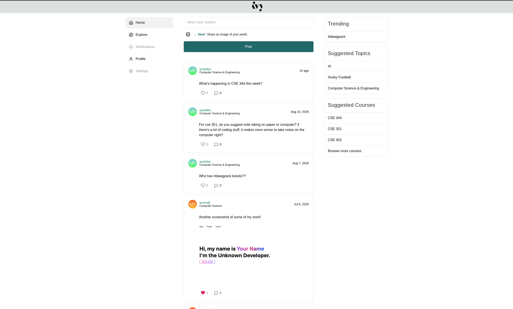

# IvyLink

IvyLink is a college-focused social platform. Registered students create an account with a school email, publish tagged text and image posts, like and comment, discover people and posts through department/course subscriptions, and see a location-based feed of nearby posts. Visitors can use a read-only guest view to browse an anonymized feed without an account.

## Preview



## Features

- Account registration and local sign-in via Passport's local strategy, with `bcryptjs` password hashing and `express-session` for session state
- A chronological member feed with server-side filtering by content type (text/image)
- Text and image post creation, with major-specific tags and client-side tag filtering
- Image posts go through an instrumented upload pipeline (`routes/upload.js`) that reports client/server latency and server heap usage per upload, so the base64 approach can be benchmarked against a future implementation
- Authenticated likes and comments on posts, both updating in place via `fetch()` without a full page reload
- Post deletion for the post's author, cascading to that post's comments and removing dangling `likedPosts` references
- Course discovery and subscription: browse courses within your organization/department, subscribe/unsubscribe, and view a course hub feed scoped to that course
- A geolocation-based "Nearby" feed that queries MongoDB's geospatial index (`$geoNear`) to surface posts within 10 km, with a human-readable distance label per post
- Member profile pages showing profile details and that member's posts
- A guest route for browsing without post interactions or member identity links
- Responsive Pug templates, security headers via Helmet, response compression, and request logging
- Mobile-first design tested across multiple screen widths

## Tech stack

| Area | Technology |
| --- | --- |
| Runtime | Node.js 16.17.1 |
| Web framework | Express 4 |
| Views | Pug |
| Database | MongoDB, accessed through the official MongoDB Node.js driver, including geospatial (`2dsphere`) queries |
| Authentication | Passport, `passport-local`, and `express-session` |
| Password hashing | `bcryptjs` |
| Validation | `express-validator` |
| File uploads | Multer (in-memory, used by the instrumented image-upload benchmark) |
| Dates | Luxon |
| Security/perf middleware | Helmet, `compression`, `cors` |
| Development reload | Nodemon |

## How it works

1. `app.js` loads the environment, connects to MongoDB, configures Express middleware (Helmet, compression, sessions, Passport), and mounts each feature's routes.
2. Passport's local strategy looks up a user by `username` and compares the submitted password against the stored bcrypt hash; the user ID is then serialized into the session and restored on later requests.
3. Feed routes join post records with their authors via MongoDB aggregation (`$lookup`) and render newest-first.
4. Courses are scoped to an `organizationId`; a user's home feed and the `/courses` index can filter by their `major`/department, and following a course adds its ID to the user's `subscribedCourses`.
5. The Nearby feed stores each post's coordinates as a GeoJSON `Point` and uses a MongoDB `$geoNear` aggregation stage (requiring a `2dsphere` index on `location`) to return posts within a fixed radius, annotated with a distance label computed at query time.
6. Browser-side code in `public/javascripts/ui-controls.js` (plus `location.js`/`distance.js` for Nearby) sends `fetch()` requests for likes, comments, deletes, course follows, and geolocation, patching the DOM in place rather than reloading the page.

## Data model

The project uses lightweight model classes across MongoDB collections rather than an ORM.

| Collection | Main fields | Notes |
| --- | --- | --- |
| `users` | `firstName`, `lastName`, `username`, `password`, `major`, `graduation`, `location`, `icon`, `colorPreference`, `member`, `organizationId`, `subscribedCourses`, `likedPosts` | Passwords are stored as bcrypt hashes. |
| `posts` | `user`, `message`, `contentType`, `postImage`, `courseId`, `timestamp`, `tags`, `likes`, `likeCount`, `commentCount`, `private`, `allowedUsers` | `courseId` links a post to a course feed when present. |
| `nearby_posts` | `user`, `message`, `imageSource`, `location` (GeoJSON `Point`), `tags`, `likes`, `likeCount`, `commentCount`, `timestamp` | Requires a `2dsphere` index on `location` for `$geoNear` queries. |
| `comments` | `postId`, `userId`, `text`, `timestamp`, `likes`, `likeCount`, `parentCommentId` | Comments are loaded oldest first, with a default limit of 10. Used for both `posts` and `nearby_posts`. |
| `courses` | `organizationId`, `department`, `courseCode`, `title` | Scoped to an organization; browsable/filterable by department. |
| `organizations` | `name`, `orgType`, `allowedDomains`, `location`, `departments`, `themeColor` | Modeled to support multiple schools; see Development notes for current enforcement status. |

## Application routes

| Method | Route | Description |
| --- | --- | --- |
| `GET` | `/` | Show the sign-in landing page or the authenticated feed. Accepts `?view=text` or `?view=image`. |
| `GET` | `/explore` | Show all posts, independent of subscriptions. |
| `GET` | `/notifications` | Show the notifications page (currently a placeholder feed). |
| `POST` | `/login` | Authenticate a user with Passport's local strategy. |
| `GET` | `/logout` | End the current session and return to the landing page. |
| `GET` | `/guest` | Show the browse-only guest feed. |
| `GET` | `/create-account` | Show the account-registration form. |
| `POST` | `/create-account` | Validate form input, hash the password, and create a user. |
| `POST` | `/post` | Create a text or image post for the authenticated user. |
| `DELETE` | `/post/:id` | Delete a post owned by the authenticated user, and its comments. |
| `POST` | `/post/:id/like` | Toggle the authenticated user's like. Returns `{ likeCount, liked }`. |
| `GET` | `/post/:postId/comments` | Return up to 10 comments for a post as JSON. |
| `POST` | `/post/:postId/comment` | Create an authenticated user's comment and return it as JSON. |
| `GET` | `/nearby` | Show posts within 10 km of the supplied coordinates. |
| `POST` | `/nearby` | Create a location-tagged post for the authenticated user. |
| `POST` | `/nearby/:id/like` | Toggle a like on a nearby post. |
| `GET`/`POST` | `/nearby/:postId/comments` / `/nearby/:postId/comment` | Fetch/create comments on a nearby post. |
| `GET` | `/courses` | Show courses in the user's organization, filterable by department. |
| `GET` | `/courses/:courseId` | Show a course hub and its posts. |
| `POST` | `/courses/:courseId/follow` / `/unfollow` | Subscribe/unsubscribe the authenticated user to a course. |
| `GET` | `/profile` | Redirect an authenticated user to their own profile. |
| `GET` | `/profile/:username` | Render a member profile and its posts. |
| `GET` | `/forgot-password` | Show the current password-recovery placeholder page. |
| `POST` | `/api/upload-naive` | Instrumented image upload benchmark; returns a base64 `imageSource` plus latency/memory metrics. |

## Project structure

```text
.
├── app.js                  # Express middleware, Passport setup, and route mounting
├── bin/www                 # HTTP server entry point and port handling
├── db/conn.js              # MongoDB connection helper
├── models/                 # User, post, comment, course, organization, and nearby-post data-access classes
├── routes/                 # Feed, auth, registration, posts, profile, courses, nearby, and upload routes
├── views/                  # Pug layouts, pages, and shared partials
└── public/                 # CSS, browser-side interactions, and image assets
```

## Development notes

- There is no automated test suite configured yet, though it is in planning stages.
- Registration validates `major` and `graduation`, but the current registration handler does not pass those values into the new `User` object, so they are not persisted for newly created accounts. This is because the scope of the site changed to only serve students at the Allen School of Computer Science at University of Washington. Therefore, 'Computer Science' is the default value for `major` until the scope of the project expands to include more majors and colleges.
- `Organization.allowedDomains` models per-school email-domain restrictions, but registration currently only checks that the submitted email ends in `.edu` and assigns every new account to one hardcoded default organization. Domain-to-organization enforcement is not yet wired up.
- Image posts go through the "naive" base64 upload benchmark in `routes/upload.js` rather than a production-grade file-storage pipeline; each upload is logged to `logs/image-upload-metrics.log`.
- Password recovery is currently a placeholder route only. It literally tells the user "Bummer, dude." This is a low-priority 'feature' that will be updated before the official launch.

## Setup

**Prerequisites:** Node.js 16.17.1 (or compatible), npm, and a reachable MongoDB deployment (e.g. MongoDB Atlas).

```bash
git clone <repository-url>
cd members-only
npm ci
```

Create a `.env` file in the project root (already git-ignored):

```dotenv
ATLAS_URI=mongodb+srv://<username>:<password>@<cluster>/?retryWrites=true&w=majority
PORT=3000
```

`ATLAS_URI` is required; a standard MongoDB connection URI works even though the variable name references Atlas. The app always connects to the `members_only` database. URL-encode the username/password if they contain URI-reserved characters.

Then run `npm run devstart` (Nodemon, reloads on change) or `npm start` (plain `node ./bin/www`), and open [http://localhost:3000](http://localhost:3000). `npm run serverstart` runs `devstart` with the `members-only:*` debug namespace enabled. The server listens on `PORT` when supplied, or `3000` by default.

## License

Copyright © 2026 Dylan Arveson. All rights reserved.

IvyLink and its source code, design, and content are proprietary. Except with prior written permission from the copyright holder, no permission is granted to use, copy, modify, distribute, sublicense, or create derivative works from this repository or its owned assets.

Third-party dependencies listed in `package.json` remain governed by their own respective licenses.

This notice is a copyright statement, not a Terms of Service or Privacy Policy. Before making IvyLink available to real students, obtain attorney-reviewed Terms of Service and a Privacy Policy that disclose what data is collected (including account/contact information and, for the Nearby feature, device location), how it is used and retained, and how a user can request deletion.
